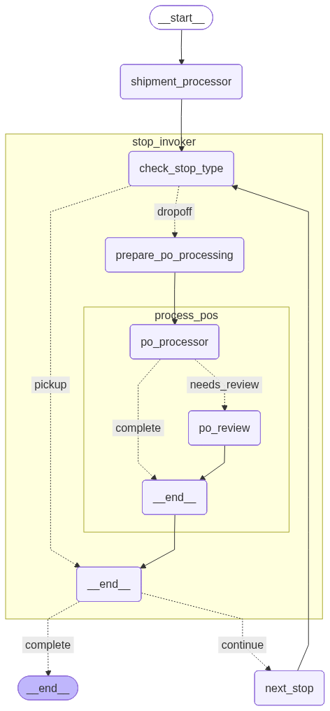

# LangGraph Shipment Processing Tutorial

A comprehensive LangGraph tutorial demonstrating advanced workflow patterns for shipment processing with stops and purchase orders.

Original Tutorial: https://www.youtube.com/watch?v=aywZrzNaKjs

Forked base: https://github.com/techwithtim/LangGraph-Tutorial



## Overview

This tutorial demonstrates a real-world shipment processing workflow that showcases:

### 1. **Hierarchical Processing**
   - Process a `Shipment` containing multiple `Stops`
   - Each `Stop` contains multiple `PurchaseOrders` (POs)
   - Demonstrates nested iteration through complex data structures

### 2. **Deterministic Routing with Conditional Nodes**
   - PICK_UP stops are automatically skipped (marked as non-escalated)
   - DROP_OFF stops are processed with full PO validation
   - Conditional edges determine processing flow based on stop type
   - Graph is mostly deterministic

### 3. **Partial State Changes**
   - Stop-level escalation status updates (`is_escalated`, `escalation_reason`)
   - PO-level state changes propagate to parent Stop
   - Demonstrates fine-grained state management

### 4. **Human-in-the-Loop Pattern**
   - Escalations trigger workflow interruption
   - Human review node simulates manual intervention
   - Resume processing after escalation resolution
   - Perfect for approval workflows and exception handling

### 5. **Parallel Processing with State Rollup** ⚡ NEW!
   - **PO-level processing**: Each PO processed through isolated subgraph
   - **True parallel execution**: Multiple POs processed concurrently using ThreadPoolExecutor
   - **Thread-safe state**: MemorySaver checkpointer with unique thread_ids
   - **Performance**: ~3x faster processing with typical PO counts
   - **State rollup**: Results roll up from PO → Stop → Shipment levels
   - **Subgraph invocation**: Stop processor invokes PO subgraph in parallel


## Architecture

### Hierarchical State Management

This tutorial uses **proper state separation** at each processing level:

- **ShipmentState**: Top level - manages stop iteration
- **StopState**: Middle level - manages PO processing
- **POState**: Bottom level - individual PO processing

## Setup

Install [UV](https://docs.astral.sh/uv/)

```bash
# set up environment variables
cp .env.example .env;
brew install uv;
uv sync;
```

## Running the Tutorial

### Command Line Demo

```bash
uv run main.py
```

This will:
- Create a sample shipment with 3 stops (1 PICK_UP, 2 DROP_OFF)
- Process POs with mixed states (SCHEDULED, PENDING, ESCALATED)
- Demonstrate human-in-the-loop for escalations
- Show partial state updates at Stop and PO levels
- Generate a mermaid diagram of the workflow

