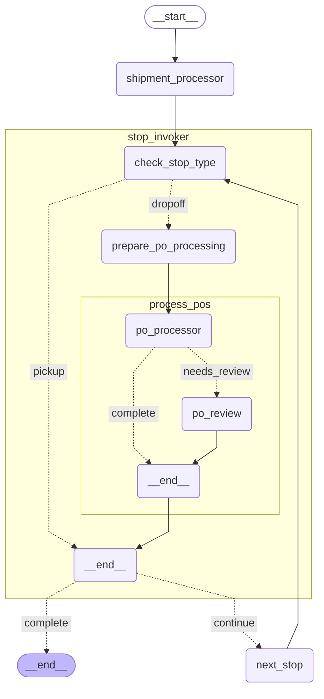

# Mermaid diagram with expanded subgraphs

This diagram shows the complete graph hierarchy including all subgraphs expanded using `xray=True`.

```mermaid
---
config:
  flowchart:
    curve: linear
---
graph TD;
	__start__([<p>__start__</p>]):::first
	shipment_processor(shipment_processor)
	next_stop(next_stop)
	__end__([<p>__end__</p>]):::last
	__start__ --> shipment_processor;
	next_stop --> stop_invoker\3acheck_stop_type;
	shipment_processor --> stop_invoker\3acheck_stop_type;
	stop_invoker\3a__end__ -. &nbsp;complete&nbsp; .-> __end__;
	stop_invoker\3a__end__ -. &nbsp;continue&nbsp; .-> next_stop;
	subgraph stop_invoker
	stop_invoker\3acheck_stop_type(check_stop_type)
	stop_invoker\3aprepare_po_processing(prepare_po_processing)
	stop_invoker\3a__end__(<p>__end__</p>)
	stop_invoker\3acheck_stop_type -. &nbsp;pickup&nbsp; .-> stop_invoker\3a__end__;
	stop_invoker\3acheck_stop_type -. &nbsp;dropoff&nbsp; .-> stop_invoker\3aprepare_po_processing;
	stop_invoker\3aprepare_po_processing --> stop_invoker\3aprocess_pos\3apo_processor;
	stop_invoker\3aprocess_pos\3a__end__ --> stop_invoker\3a__end__;
	subgraph process_pos
	stop_invoker\3aprocess_pos\3apo_processor(po_processor)
	stop_invoker\3aprocess_pos\3apo_review(po_review)
	stop_invoker\3aprocess_pos\3a__end__(<p>__end__</p>)
	stop_invoker\3aprocess_pos\3apo_processor -. &nbsp;complete&nbsp; .-> stop_invoker\3aprocess_pos\3a__end__;
	stop_invoker\3aprocess_pos\3apo_processor -. &nbsp;needs_review&nbsp; .-> stop_invoker\3aprocess_pos\3apo_review;
	stop_invoker\3aprocess_pos\3apo_review --> stop_invoker\3aprocess_pos\3a__end__;
	end
	end
	classDef default fill:#f2f0ff,line-height:1.2
	classDef first fill-opacity:0
	classDef last fill:#bfb6fc

```
